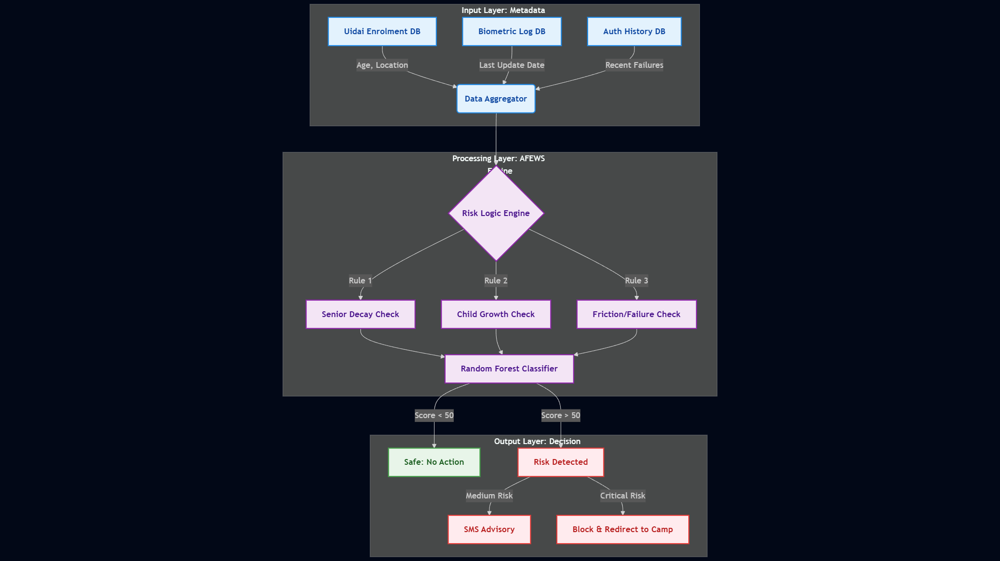
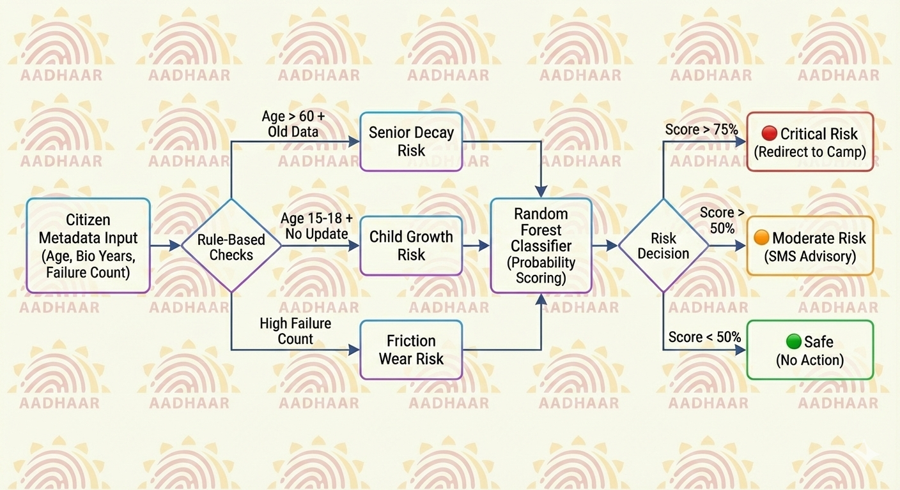
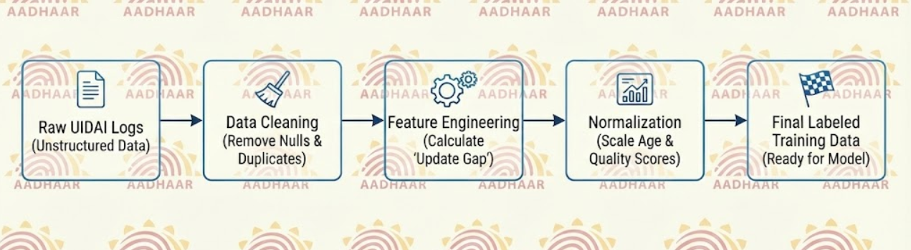

# 🛡️ AFEWS: Aadhaar Failure Early Warning System


> **"Shifting from Reactive Correction to Predictive Protection."**

AFEWS is a machine learning-based decision support system designed to predict **Aadhaar Authentication Failures** before they happen. By analyzing metadata trends (Age, Biometric Update Latency, Device Quality), it identifies citizens at risk of service exclusion and triggers proactive advisories.

## 🔗 Live Demo
**Try the Risk Engine Live:** [👉 Click Here to Open Hugging Face App](https://huggingface.co/spaces/RatVin/demo)

---

## 🏗️ System Architecture
This high-level architecture explains how AFEWS aggregates data, processes risk rules, and delivers the final verdict.



---

## 🧠 How It Works (The Logic Flow)
The core of AFEWS relies on a hybrid logic engine that combines **biological rules** with **statistical patterns**.



---

## 🚨 The Problem
Currently, UIDAI's ecosystem is **Reactive**:
1.  Citizen visits a service center (Ration/Pension).
2.  Authentication **Fails** due to aging biometrics.
3.  Service is **Denied**.
4.  Citizen rushes to update data (takes 1-2 weeks).

## 💡 The Solution (AFEWS)
We propose a **Proactive** metadata analysis engine:
1.  **Predict:** The model scans update logs to calculate a "Biometric Health Score".
2.  **Warn:** If Risk > 75%, an automated advisory (SMS/WhatsApp) is sent.
3.  **Act:** Citizen updates biometrics *before* needing the service.

---

## ⚙️ Risk Factors & Logic
Our Random Forest model is trained on **Societal Trends** derived from official UIDAI datasets:

| Risk Factor | Threshold | Reason |
| :--- | :--- | :--- |
| **Senior Decay** | Age > 60 + Bio Update > 7 Years | Skin elasticity loss degrades fingerprint quality. |
| **Child Growth** | Age 15-18 + Bio Update > 2 Years | Hand geometry changes rapidly during puberty. |
| **Digital Dormancy** | Mobile Link > 5 Years Old | High risk of lost access to OTP backup. |

---

## 🔄 Data Pipeline & Preprocessing
We treat data quality as a priority. Raw logs go through a rigorous cleaning process before training.



### Data Processing Steps:
| Processing Step | Description |
| :--- | :--- |
| **Imputation** | Filled missing regional data using district-level averages. |
| **Binning** | Grouped ages into cohorts (Child: 5-15, Adult: 18-60, Senior: 60+) for biological relevance. |
| **Scaling** | Normalized 'Years Since Update' (0-10 scale) to prevent bias. |

---

## 🛠️ Tech Stack & Repository Structure

```text
📂 AFEWS-Repo/
 │
 ├── 📂 datasets/                   (Data Ingestion Layer)
 │    ├── 📄 sample_raw_data.csv       (Raw UIDAI Logs - Unstructured)
 │    └── 📄 final_training_data.csv   (Labeled Risk Data - Processed)
 │
 ├── 📂 src/                        (Core Intelligence Module)
 │    └── 📄 data_generator.py         (Synthetic Pattern Engine)
 │
 ├── 📄 app.py                      (Inference Engine - Gradio)
 ├── 📄 requirements.txt            (Dependencies)
 ├── 📄 architecture_diagram.png    (System Blueprint)
 ├── 📄 logic_flow.png              (Logic Flowchart)
 └── 📄 data_pipeline.png           (Data Pipeline Flowchart)

